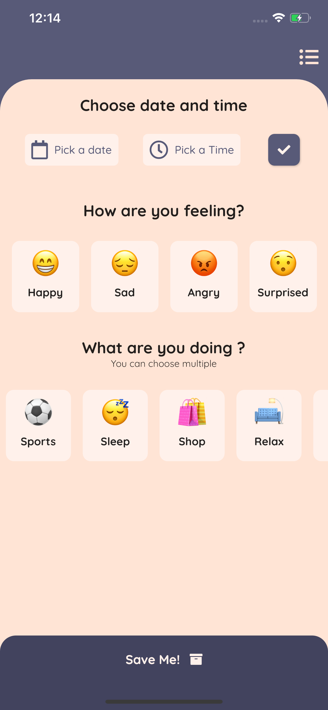
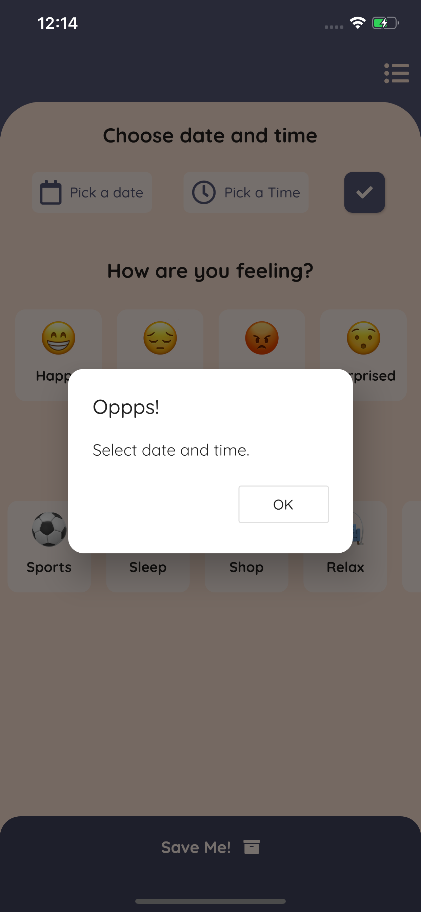
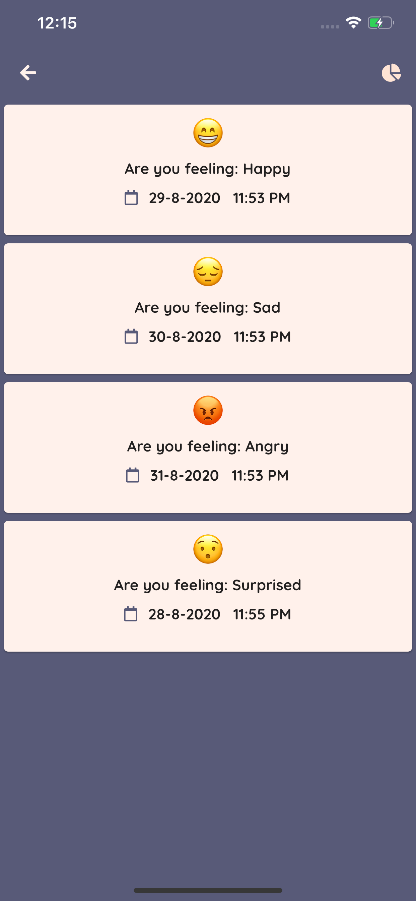
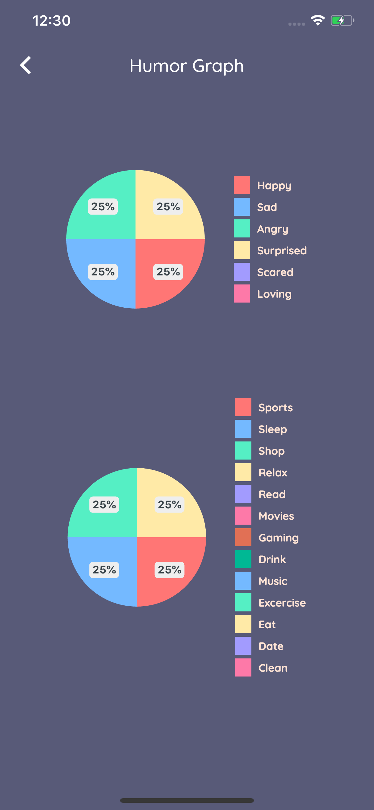

# App Humor Diary

  
  
  
  

## Flutter

- [Flutter.dev](https://flutter.dev/)

## Plugins used

- [sqflite](https://pub.dev/packages/sqflite): ^1.3.1
- [provider](https://pub.dev/packages/provider): ^4.3.2+1
- [charts_flutter](https://pub.dev/packages/charts_flutter): ^0.9.0
- [pie_chart](https://pub.dev/packages/pie_chart): ^3.1.1
- [font_awesome_flutter](https://pub.dev/packages/font_awesome_flutter): ^8.8.1